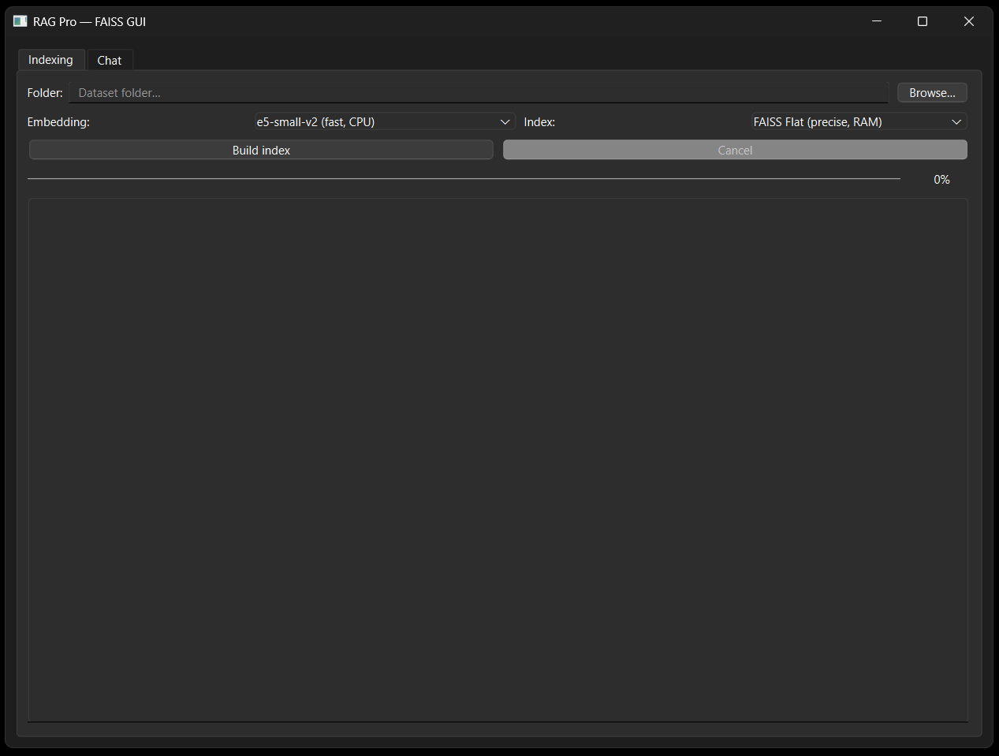
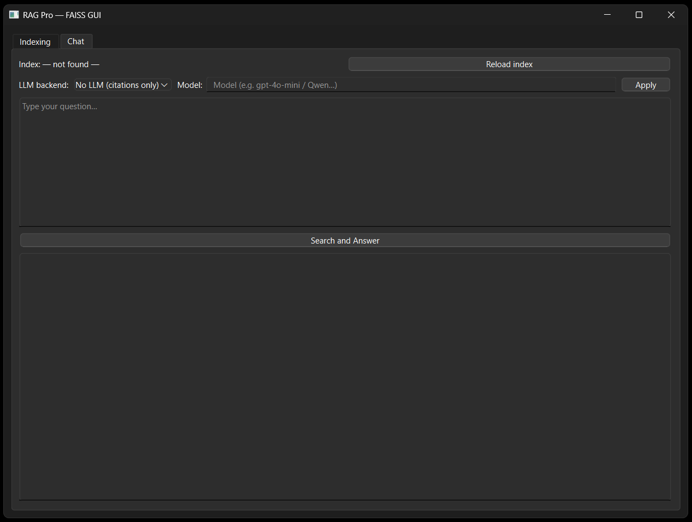

# AI‑RAG‑docuquery

An **AI‑powered document search app** using **FAISS** for vector search and **Retrieval‑Augmented Generation (RAG)**. Index your local documents, ask natural‑language questions, and get source‑grounded answers with clickable citations.

> GUI: **PyQt6** • Embeddings: **Sentence‑Transformers (E5/MiniLM)** • LLM backends: **OpenAI / compatible**, **Local HuggingFace**, or **No LLM (citations‑only)**.

---

## Table of Contents

* [What’s New in v2.0](#whats-new-in-v20)
* [Requirements](#requirements)
* [Quick Start (Windows)](#quick-start-windows)
* [Run From Source](#run-from-source)
* [Usage](#usage)

  * [Index Documents](#index-documents)
  * [Chat & Answers](#chat--answers)
  * [LLM Backends](#llm-backends)
  * [Config Persistence](#config-persistence)
* [Build a Windows EXE](#build-a-windows-exe)
* [Troubleshooting](#troubleshooting)
* [Project Structure](#project-structure)
* [Screenshots](#screenshots)
* [License](#license)
* [Changelog](#changelog)
* [Roadmap](#roadmap)

---

## What’s New in v2.0

* ✅ **Clickable source links** now open local files directly from the results panel (handled via `anchorClicked` → `QDesktopServices.openUrl`).
* ✅ **Hot‑swap LLM backend** without restarting the app (OpenAI ↔ HuggingFace local ↔ Citations‑only).
* ✅ **OpenAI setup dialog** with **model picker** (presets + custom), optional **Base URL** (for compatible endpoints), and **remember** toggle.
* ✅ **Working local AI (HF local)** support to Hugging Face local AI
* ✅ **Removed llama.cpp / GGUF** support to simplify setup and reduce build complexity.
* ✅ **More relevant results** support to simplify setup and reduce build complexity.


---

## Requirements

* **Python 3.10–3.12** (recommended 3.11/3.12)
* Windows 10/11 (tested). macOS/Linux should also run from source.
* Packages: see `requirements.txt`

  * PyQt6, faiss‑cpu, sentence‑transformers, transformers, torch, pymupdf, pypdf, pandas, openai, etc.

> Note: Sentence‑Transformers models are downloaded on first use and cached in your HF cache. You can pre‑download and bundle them; see **Build** and **Troubleshooting**.

---

## Run From Source

**Windows (PowerShell):**

```powershell
python3 -m venv .venv
.venv\Scripts\activate
pip install -r requirements.txt
python app_qt.py
```

## Run the prebuilt EXE (Windows)

* Download the prebuilt AI-RAG-docuquery.exe from the GitHub Releases page, or
* Use the local build you created with PyInstaller (found at dist/AI-RAG-docuquery.exe).
* Just double‑click the EXE to launch the app.

> Note: On first launch, Windows SmartScreen may prompt a security warning. Click More info → Run anyway if you trust the binary.


---

## Usage

### Index Documents

1. Open the **Indexing** tab.
2. **Folder → Browse…** and pick a directory containing PDFs / DOCX / PPTX / XLSX / TXT / CSV / MD.
3. Choose **Embedding** and **Index** type (default is good).
4. Click **Build index**. Progress and logs appear below.
5. When done, switch to **Chat**.

> Index location: `./faiss_index` (contains `index.faiss`, `meta.jsonl`, `index.json`).

### Chat & Answers

* Type your question and click **Search and Answer**.
* If similarity is high enough, the app uses your chosen LLM to write a **concise, cited answer**.
* **Sources** show rank, filename, page and a **Open** link that launches the file with your default viewer.
* If no LLM is selected (**No LLM**), you’ll see a *citations‑only* view with the closest passages.

### LLM Backends

* **No LLM (citations‑only)** → Fastest, shows retrieved passages only.
* **OpenAI / compatible** → Choose backend, a dialog pops up:

  * Enter **API key**, optional **Base URL**, and pick a **model** (e.g. `gpt-4o-mini`).
  * Optionally **Remember** to save into local config (see below).
  * Applied immediately; no restart.
* **Local HuggingFace** → Enter a model id (e.g. `Qwen/Qwen2.5-0.5B-Instruct`).

  * Runs on CPU by default; uses GPU automatically if available (`torch.cuda.is_available()`).

### Config Persistence

Local config file used for OpenAI credentials and defaults:

* **Windows:** `%APPDATA%/RAG-Pro/config.json`
* **macOS/Linux:** `~/.rag-pro/config.json`

---

## Build a Windows EXE

> Use **onedir** for maximum robustness with native DLLs; **onefile** works too but may have longer startup time.

**One‑file (single .exe):**

```powershell
pyinstaller app_qt.py --name AI-RAG-docuquery --icon app-icon.ico --onefile --noconsole --noconfirm --collect-all sentence_transformers --collect-all transformers --collect-all torch --collect-all faiss --collect-all pymupdf --collect-submodules fitz
```

**One‑dir (folder, more reliable):**

```powershell
pyinstaller app_qt.py --name AI-RAG-docuquery --icon app-icon.ico --windowed --onedir --noconfirm --collect-all sentence_transformers --collect-all transformers --collect-all torch --collect-all faiss --collect-all pymupdf --collect-submodules fitz
```

**Optional: ship a prebuilt FAISS index**

```powershell
... --add-data "faiss_index;faiss_index"
```

---

## Troubleshooting

* **Missing DLL / app won’t start:** try the **onedir** build; ensure you run PyInstaller in the same venv where you installed requirements.
* **OpenAI error:** set a valid `OPENAI_API_KEY` in the dialog (or env), optionally `OPENAI_BASE_URL` for compatible providers.
* **“Index: — not found —”**: build the index in the **Indexing** tab or copy a prepared `faiss_index/` next to the executable and click **Reload index**.
* **HF Local model too slow / OOM:** try a smaller model id.
* **PDF extraction issues:** PyMuPDF is used first, then pypdf as fallback. Problematic files will be logged as `[SKIP]`.

---

## Project Structure

```
project/
│──check_cuda.py       # Utility script to check CUDA availability
├─ app_qt.py              # PyQt6 GUI
├─ indexer.py             # builds FAISS index from local files
├─ retrieve.py            # hybrid search (dense + optional BM25 mixing)
├─ loaders.py             # file loaders: PDF, DOCX, PPTX, XLSX, TXT, CSV, MD
├─ llm_clients.py         # NoLLM, OpenAI, HF Local
├─ config.py              # presets, defaults, index/embedding choices
├─ requirements.txt
└─ faiss_index/           # generated at runtime (index.faiss, meta.jsonl, index.json)
```

---

## Screenshots

> *Place your screenshots here*

* Indexing tab

  

* Chat tab (answer with sources)

  

---

## License

MIT License

Copyright (c) 2025 Paolo Ronco

Permission is hereby granted, free of charge, to any person obtaining a copy
of this software and associated documentation files (the "Software"), to deal
in the Software without restriction, including without limitation the rights
to use, copy, modify, merge, publish, distribute, sublicense, and/or sell
copies of the Software, and to permit persons to whom the Software is
furnished to do so, subject to the following conditions:

The above copyright notice and this permission notice shall be included in all
copies or substantial portions of the Software.

THE SOFTWARE IS PROVIDED "AS IS", WITHOUT WARRANTY OF ANY KIND, EXPRESS OR
IMPLIED, INCLUDING BUT NOT LIMITED TO THE WARRANTIES OF MERCHANTABILITY,
FITNESS FOR A PARTICULAR PURPOSE AND NONINFRINGEMENT. IN NO EVENT SHALL THE
AUTHORS OR COPYRIGHT HOLDERS BE LIABLE FOR ANY CLAIM, DAMAGES OR OTHER
LIABILITY, WHETHER IN AN ACTION OF CONTRACT, TORT OR OTHERWISE, ARISING FROM,
OUT OF OR IN CONNECTION WITH THE SOFTWARE OR THE USE OR OTHER DEALINGS IN THE
SOFTWARE.

---

## Changelog

### v2.0 — 2025‑08‑27

* **Clickable source links** now open local files directly from the results panel (handled via `anchorClicked` → `QDesktopServices.openUrl`).
* **Hot‑swap LLM backend** without restarting the app (OpenAI ↔ HuggingFace local ↔ Citations‑only).
* **OpenAI setup dialog** with **model picker** (presets + custom), optional **Base URL** (for compatible endpoints), and **remember** toggle.
* **Working local AI (HF local)** support to Hugging Face local AI
* **Removed llama.cpp / GGUF** support to simplify setup and reduce build complexity.
* **More relevant results** support to simplify setup and reduce build complexity.


### v1.x

* Initial FAISS‑based RAG GUI; hybrid retrieval with BM25 mixing; multi‑format loaders.

---

## Roadmap

* Multi‑index management (create, switch, and merge multiple FAISS indexes).
* Bigger datasets: sharded / on‑disk FAISS indexes and tuning to scale to tens of millions of vectors.
* More AI providers: adapters for additional providers (e.g., Azure‑compatible, Anthropic, Google, Mistral‑compatible).
* Ranking & relevance: refine hybrid scoring (dense + sparse), smarter passage de‑duplication and merging.
