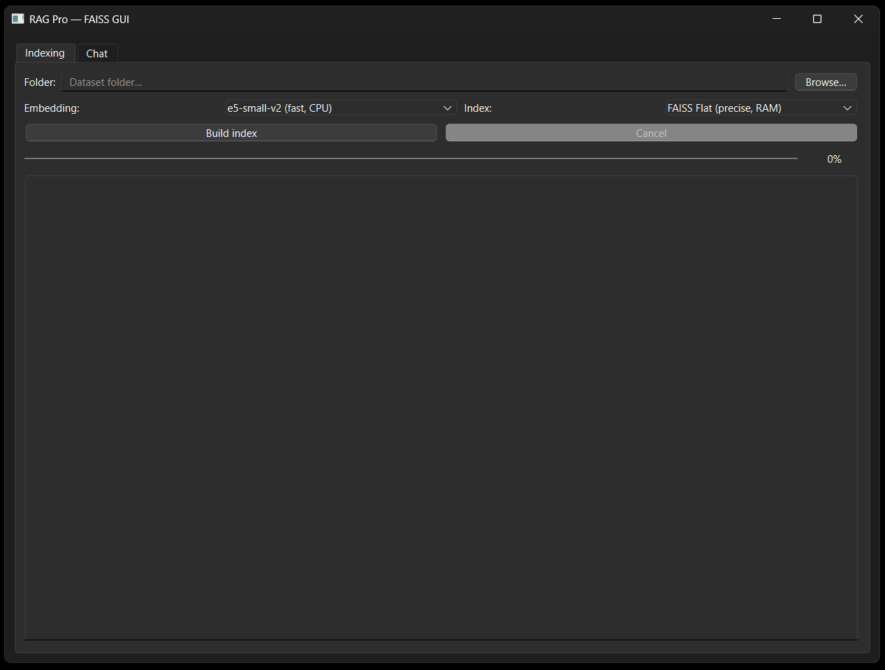
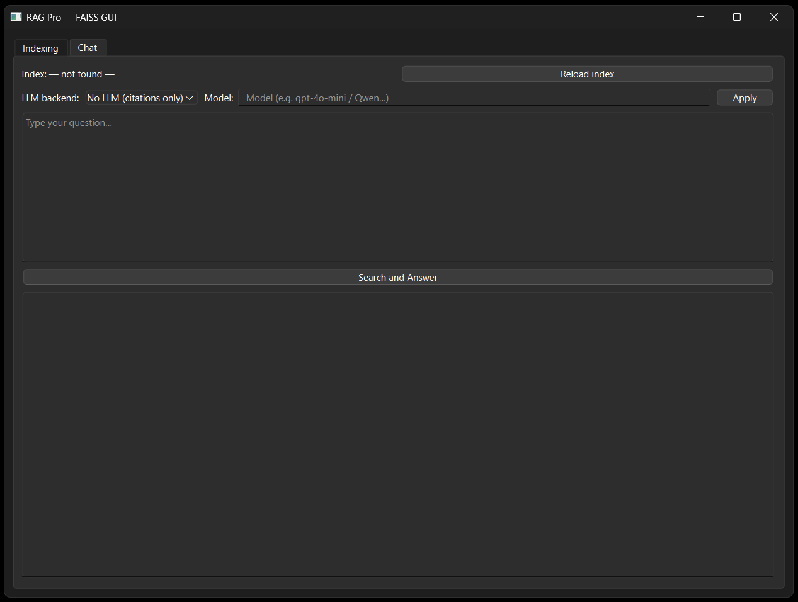

# AI-RAG-docuquery

An **AI-powered document search app** using **FAISS** for vector search and **Retrieval-Augmented Generation (RAG)**. Index your local documents, ask natural-language questions, and get source-grounded answers with clickable citations.

> **GUI:** PyQt6 &nbsp;|&nbsp; **Embeddings:** Sentence-Transformers (E5/MiniLM) &nbsp;|&nbsp; **LLM backends:** OpenAI, Anthropic Claude, Local HuggingFace, or No LLM (citations-only)

---

## Table of Contents

- [Quick Start](#quick-start)
- [Features](#features)
- [Usage](#usage)
- [Requirements](#requirements)
- [Build a Windows EXE](#build-a-windows-exe)
- [Troubleshooting](#troubleshooting)
- [Project Structure](#project-structure)
- [Changelog](#changelog)
- [Roadmap](#roadmap)
- [Screenshots](#screenshots)
- [License](#license)

---

## Quick Start

**Download** the latest `.exe` from [Releases](../../releases) and double-click to run.

> On first launch, Windows SmartScreen may show a warning — click **More info → Run anyway**.

**Or run from source:**

```powershell
python3 -m venv .venv
.venv\Scripts\activate
pip install -r requirements.txt
python app_qt.py
```

---

## Features

| Feature | Details |
|---|---|
| Multi-format indexing | PDF, DOCX, PPTX, XLSX, TXT, CSV, MD |
| Hybrid search | Dense (FAISS) + sparse (BM25) retrieval |
| Cross-encoder re-ranking | Optional re-ranking checkbox in Chat tab |
| Multiple LLM backends | OpenAI, Anthropic Claude, HuggingFace local, or none |
| Multi-index support | Create, switch, rename, and delete named indexes |
| Persistent chat history | Q&A pairs preserved per session with clear button |
| Clickable citations | Source links open files with default viewer |
| Answer language | Auto-detect or force a specific language |
| Ctrl+Enter shortcut | Submit question without clicking the button |
| Copy answer | Copy the full answer to clipboard with one click |
| Export chat | Save the conversation as `.md` or `.txt` |
| Thinking indicator | Animated "Thinking…" label while the LLM generates |
| Status bar | Shows active index, backend, and re-rank state |

---

## Usage

### 1. Index Documents

1. Open the **Indexing** tab.
2. Click **Browse…** and pick a folder (PDF / DOCX / PPTX / XLSX / TXT / CSV / MD).
3. Give your index a name (auto-filled from folder name).
4. Click **Build index** — progress appears in the log below.

### 2. Chat & Answers

1. Switch to the **Chat** tab, select your index from the dropdown.
2. Type a question and click **Search and Answer**.
3. The app retrieves relevant passages and (if an LLM is configured) generates a cited answer.
4. **Sources** show rank, filename, page, and an **Open** link.

### 3. LLM Backends

| Backend | How to configure |
|---|---|
| **No LLM** | Select in dropdown — shows retrieved passages only |
| **OpenAI / compatible** | Dialog: API key, optional Base URL, model picker |
| **Anthropic Claude** | Dialog: API key (`sk-ant-…`), model picker |
| **Local HuggingFace** | Enter a model id (e.g. `Qwen/Qwen2.5-0.5B-Instruct`) |

All credentials can be saved with the **Remember** toggle.

### 4. Manage Indexes

At the bottom of the Indexing tab: select an index from the **Manage index** dropdown, then **Rename…** or **Delete** it.

---

## Requirements

- Python 3.10–3.12 (recommended 3.11/3.12)
- Windows 10/11 (macOS/Linux supported from source)
- See `requirements.txt` for full package list

> Sentence-Transformers models download on first use (~100 MB) and are cached in your HF cache directory.

---

<details>
<summary><strong>Build a Windows EXE</strong></summary>

> Use **onedir** for maximum robustness with native DLLs; **onefile** works too but has a longer startup time.

**One-file (single .exe):**

```powershell
pyinstaller app_qt.py --name AI-RAG-docuquery --icon app-icon.ico --onefile --noconsole --noconfirm --collect-all sentence_transformers --collect-all transformers --collect-all torch --collect-all faiss --collect-all pymupdf --collect-submodules fitz
```

**One-dir (folder, more reliable):**

```powershell
pyinstaller app_qt.py --name AI-RAG-docuquery --icon app-icon.ico --windowed --onedir --noconfirm --collect-all sentence_transformers --collect-all transformers --collect-all torch --collect-all faiss --collect-all pymupdf --collect-submodules fitz
```

**Optional — ship a prebuilt FAISS index:**

```powershell
... --add-data "faiss_index;faiss_index"
```

</details>

<details>
<summary><strong>Troubleshooting</strong></summary>

| Problem | Fix |
|---|---|
| Missing DLL / app won't start | Use the **onedir** build; run PyInstaller inside the same venv |
| OpenAI error | Enter a valid API key in the dialog; set `OPENAI_BASE_URL` for compatible providers |
| `Index: — not found —` | Build an index in the Indexing tab first |
| HF Local model too slow / OOM | Try a smaller model id |
| PDF extraction issues | PyMuPDF is tried first, then pypdf. Problematic files appear as `[SKIP]` in the log |

</details>

<details>
<summary><strong>Project Structure</strong></summary>

```
project/
├── app_qt.py         # PyQt6 GUI
├── indexer.py        # Builds FAISS index from local files
├── retrieve.py       # Hybrid search (dense + BM25 + cross-encoder re-ranking)
├── loaders.py        # File loaders: PDF, DOCX, PPTX, XLSX, TXT, CSV, MD
├── llm_clients.py    # NoLLM, OpenAI, Anthropic, HF Local
├── config.py         # Presets, defaults, index/embedding choices
├── requirements.txt
└── check_cuda.py     # Utility: check CUDA availability
```

Config & indexes stored in:
- **Windows:** `%APPDATA%/RAG-Pro/`
- **macOS/Linux:** `~/.rag-pro/`

</details>

<details>
<summary><strong>Changelog</strong></summary>

### v2.6 — 2026-03-25
- **Ctrl+Enter** — submit question from keyboard without clicking the button.
- **Copy answer** — button copies the full chat output to clipboard.
- **Export chat** — saves the conversation as `.md` or `.txt` via a file dialog.
- **Thinking indicator** — animated "Thinking…" label while the LLM generates a response.
- **Status bar** — permanent bar at the bottom showing: active index + vector count, LLM backend, re-rank on/off.

### v2.5 — 2026-03-25
- **Cross-encoder re-ranking** — "Re-rank results" checkbox; lazy-loads `cross-encoder/ms-marco-MiniLM-L-6-v2` (~25 MB) on first use, freed when disabled.
- **Answer language selector** — Auto-detect / English / Italiano / Français / Español / Deutsch.
- **Updated OpenAI presets** — `gpt-4.1`, `gpt-4.1-mini`, `gpt-4.1-nano`, `o3`, `o4-mini`, `o3-mini`.

### v2.4 — 2026-03-25
- **Index management** — Rename and Delete buttons in the Indexing tab; confirmation before delete; Chat selector stays in sync.

### v2.3 — 2026-03-25
- **Anthropic Claude backend** — dialog for API key + model selection; supports `claude-haiku-4-5`, `claude-sonnet-4-6`, `claude-opus-4-6` and custom ids. Config persisted with optional Remember toggle.

### v2.2 — 2026-03-24
- **Multi-index support** — indexes saved under `%APPDATA%/RAG-Pro/indexes/<name>/`.
- **Index selector dropdown** in Chat tab — switch datasets on the fly.
- **Refresh button (↻)** — rescans indexes directory without restarting.

### v2.1 — 2026-03-24
- **Chat history** — Q&A pairs persist per session; auto-scroll to latest answer.
- **Clear history button** — resets the conversation panel.

### v2.0 — 2025-08-27
- **Clickable source links** — open local files from the results panel.
- **Hot-swap LLM backend** — switch without restarting the app.
- **OpenAI setup dialog** — model picker, optional Base URL, remember toggle.
- **HuggingFace local** — runs on CPU; uses GPU if available.
- Removed llama.cpp / GGUF support.

### v1.x
- Initial FAISS-based RAG GUI; hybrid retrieval with BM25; multi-format loaders.

</details>

---

## Roadmap

- More AI providers (Azure, Google Gemini, Mistral-compatible)
- Streaming responses (OpenAI / Anthropic)
- Incremental indexing (add files without full rebuild)
- Export chat history as `.md` / `.txt`
- Dark mode

---

## Screenshots

| Indexing tab | Chat tab |
|---|---|
|  |  |

---

## License

MIT License — Copyright (c) 2025 Paolo Ronco

<details>
<summary>Full license text</summary>

Permission is hereby granted, free of charge, to any person obtaining a copy of this software and associated documentation files (the "Software"), to deal in the Software without restriction, including without limitation the rights to use, copy, modify, merge, publish, distribute, sublicense, and/or sell copies of the Software, and to permit persons to whom the Software is furnished to do so, subject to the following conditions:

The above copyright notice and this permission notice shall be included in all copies or substantial portions of the Software.

THE SOFTWARE IS PROVIDED "AS IS", WITHOUT WARRANTY OF ANY KIND, EXPRESS OR IMPLIED, INCLUDING BUT NOT LIMITED TO THE WARRANTIES OF MERCHANTABILITY, FITNESS FOR A PARTICULAR PURPOSE AND NONINFRINGEMENT. IN NO EVENT SHALL THE AUTHORS OR COPYRIGHT HOLDERS BE LIABLE FOR ANY CLAIM, DAMAGES OR OTHER LIABILITY, WHETHER IN AN ACTION OF CONTRACT, TORT OR OTHERWISE, ARISING FROM, OUT OF OR IN CONNECTION WITH THE SOFTWARE OR THE USE OR OTHER DEALINGS IN THE SOFTWARE.

</details>
